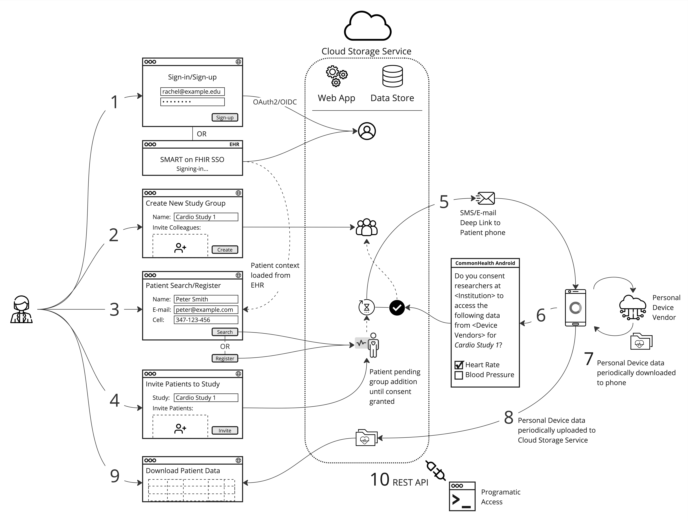
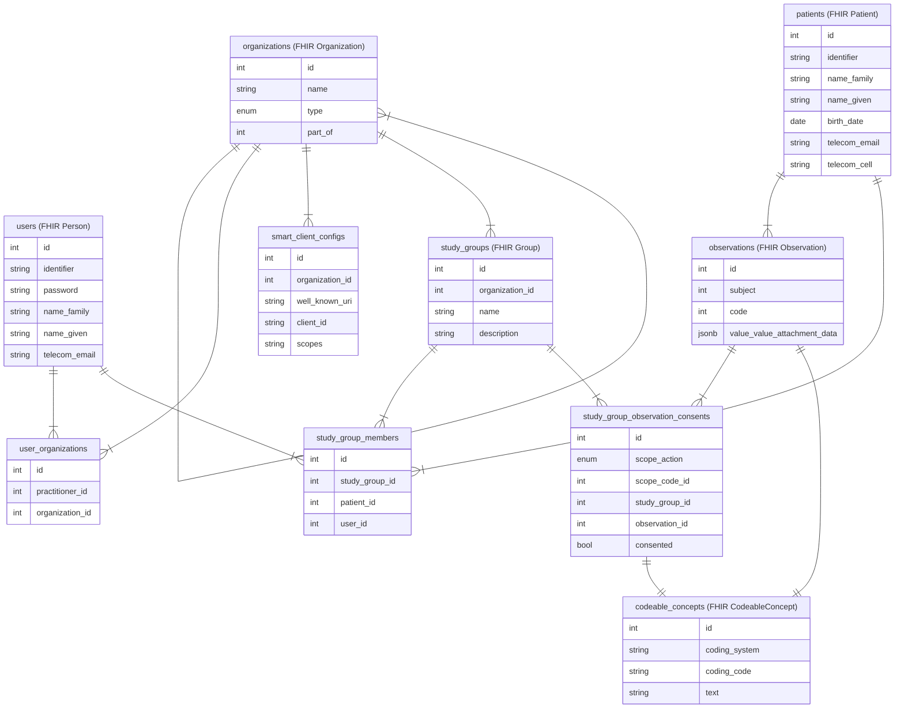
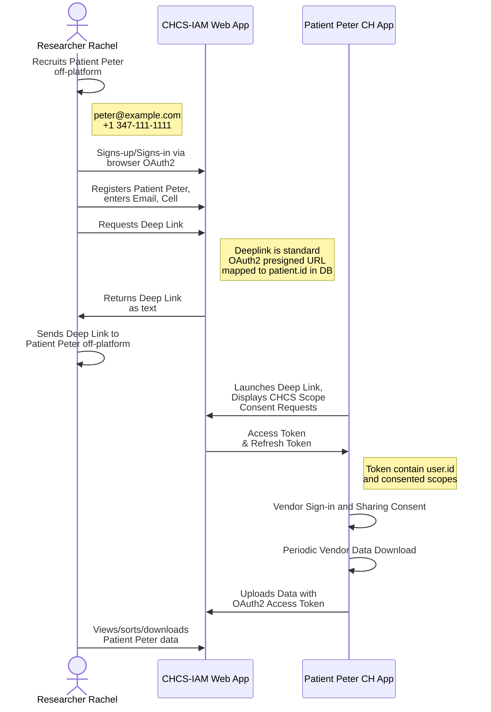
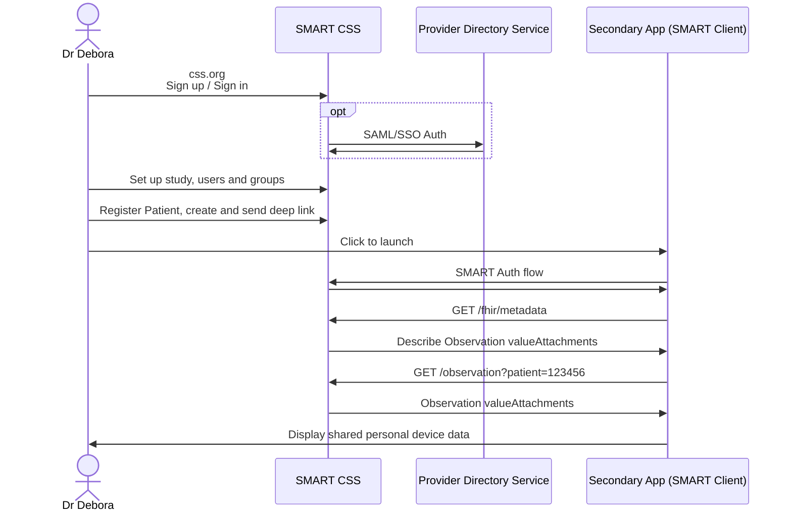
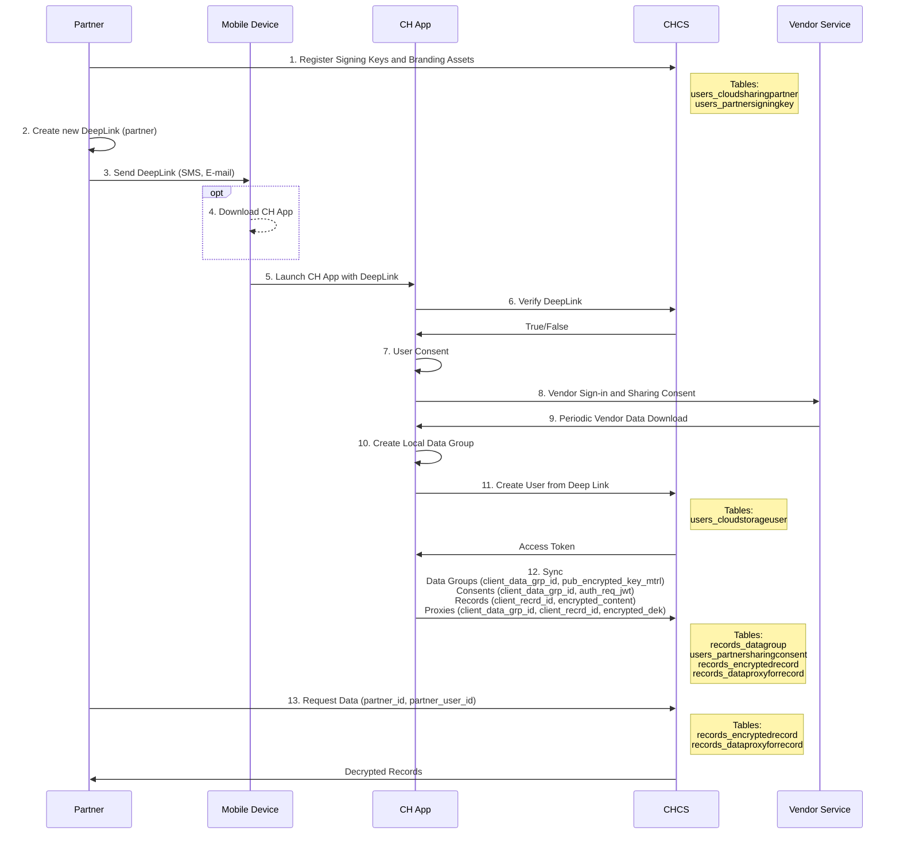

# Background

CommonHealth-CloudStorage Service (CHCS) is a web app built with Django that is used to share a patient's personal device data with researchers via the Common Health Android app. The established CHCS was required to support deployment to third-party servers without compromising data privacy and security. This was achieved by extensive use of cryptography and proxy design patterns, as outlined in [this Google doc](https://docs.google.com/document/d/1jyS6A78BfAVTRzmwBRAim5MyQUOUHa_T7rm9tbzWLaE/edit?usp=sharing).

The CHCS service is a temporary solution being utilized for the Preliminary Blood Pressure Prototype project.

# Problem

The cryptographic requirements for healthcare providers and researchers to access and integrate with CHCS are cumbersome and impeding adoption. In addition given that the technology stacks for the Agile Metabolic Health project will be deployed within the healthcare organization HIPAA compliant environment the added cyrptographic requirements are not necessary.

# Proposal

Drop the requirement to host CHCS on third-party servers and therefore the dependency on cryptography and instead support healthcare industry standards for authentication, authorization and integration.

The new Cloud Storage Service implementation will support the following use cases for researcher end-users:

1. Provider and Researcher access:
   1. Administrator sets up organization hierarchies for institution, department, etc. (Not displayed in diagram)
   1. Administrator creates study groups and invites Providers and Researchers to study groups.
   1. Provider or Researcher signs-in from web browser or from a SMART on FHIR EHR launch.
1. Provider searches for existing patients or registers new patients. If SMART on FHIR launch, patient details are pulled from the EHR context.
1. Provider invites selected patients to selected study group (pending consent).
1. Deep Link is sent by SMS or E-mail to invited patients.
1. Patient launches deep link via Common Health Android app and gives explicit consent for their specific personal device data to be shared with a specific study group.
1. The Patient authorizes the Common Health Android app to sync with the personal device vendor's api.
1. The Common Health Android app periodically downloads vendor personal device data to the patient's Android device.
1. The Common Health Android app periodically uploads pesonal device data in Open mHealth format to the Cloud Storage Service.
1. Jupyter Health hub programmatically accesses the Cloud Storage Service REST API with OAuth2/OIDC.
1. Researcher interacts with study group data via a Jupyter Health hub creating intuitive dashboards for the Provider to view and interact with the study group data.
1. Provider interacts with the Jupyter Health dashboards. Initially this may be a simple web application, but will eventually be a Provider SMART app within the EHR vendor environment.
1. A REST API with OAuth2 for programmatic access



# Technical Design

## Authentication and Authorization

### Direct Browser Access

E-mail/password sign-up and sign-in will be supported using the conventional [django-oauth-toolkit](https://github.com/jazzband/django-oauth-toolkit) using OIDC and OAuth2.

### EHR Launch

A separate URI will be set up for EHR SMART on FHIR launches and the application will map the user's FHIR ID in `users.identifier` (see ERD below). The token checks in [django-oauth-toolkit](https://github.com/jazzband/django-oauth-toolkit) will need to be extended to switch for verification of tokens using the EHR keys for SMART launches (eg see [Epic docs](https://fhir.epic.com/Documentation?docId=oauth2&section=Embedded-Oauth2-Launch_Validating-OIDC-ID-Token)). The EHR launch may include contextual information such as the Patient ID that can be used by CHCS to shortcut to the corresponding patient screen.

### Access Control

A user may choose to consent/share only a specific subset of *scopes* (eg Heart Rate) from a specific subset of personal device data (eg *iHealth*) with a specific study group. This fine-grained access control requires joining study groups (organizations) and personal device data (observations) with a reference to scopes.

The original requirements envisioned this IAM web app to be only concerned with authentication and authorization and retain the existing CHCS for data management. However to support the required fine-grained access control, the IAM web app needs to maintain a database with references to the complete catalog of data (or at minimum proxies for all data records). To achieve this with two different databases requires a syncing process to keep both databases up to date which adds significant complexity. It is therefore proposed to consolidate the IAM app and database with the Cloud Storage Service app and database.

### SMART Scopes

SMART v2 [supports scopes to include search parameters](https://hl7.org/fhir/smart-app-launch/scopes-and-launch-context.html#finer-grained-resource-constraints-using-search-parameters), so in addition to scoping by resource (eg Observation) codes (eg Heart Rate) can be used to filter from the database and restrict access accordingly, eg

```
patient/Observation.r?code=http://purl.bioontology.org/ontology/SNOMEDCT/78564009
(Read Heart Rate)
```

A `code` parameter will be used to map SMART scopes to the corresponding Open mHealth SNOMED scope eg `OMHealthResource.HeartRate.Read`

## Extensibility Considerations

### Deep Link launches from Web Browsers

- There may be a future requirement to support a web-based flow in addition to CommonHealth app-based flows. For example, it may be impractical to send different Deep Links based on the OS or whether or not the patient has an Android device. Instead, the Deep Link could launch a regular browser screen and display the consent prompt.
- In order to implement this, instead of the personal device data downloading from the vendor server to the patient's phone or tablet (and then syncing from the Android device to the Cloud Storage Service), the Cloud Storage Service backend would instead fetch the data directly from the personal device vendor's server in the background.

## Data Model

### Open mHealth

Personal device data is expected to be in the [Open mHealth](https://www.openmhealth.org/documentation/#/overview/get-started) (JSON) format however the system can be easily extended to support binary data attachments or individual observation records. Binary JSON database fields (such as `jsonb` in Postgres) allow the structured JSON data to be queried from SQL.

### FHIR

Tables and columns use a subset of the FHIR standard as a guide to support future extensibility and integration compatibility, for example the column `user.name_family` maps to the FHIR `Person.name.family` . The FHIR [Observation](https://build.fhir.org/observation.html) supports a `value.valueAttachment` field to attach binary data, in this case binary JSON data in Open mHealth format. The FHIR [CodeableConcept](https://build.fhir.org/datatypes.html#CodeableConcept) is used for scopes to reference the Open mHealth SNOMED code, eg 78564009 for Heart Rate.



#### Users ([FHIR Person](https://build.fhir.org/person.html))

- Researchers, providers, collaborators, admin staff etc
- A User belongs to one or more Organization hierarchies (eg *Weill Cornell > Department of Cardiology > Lopez Lab*).
- `identifier` is used to reference the EHR User identifier for SMART launches.
- A User can be a member of a Study Group (regardless of their Organization to allow for outside collaboration).

#### Organizations ([FHIR Organization](https://build.fhir.org/organization.html))

- Hierarchy of institution, department, team etc.
- Recursively defines an organizational hierarchy using `part_of` to reference a parent `organization.id`.
- `type` is a subset of https://build.fhir.org/valueset-organization-type.html
- Organizations have zero or one SMART Client Config records that are shared with all sub-organizations.
- Organizations have one or more Study Groups that are shared with all Organization members and sub-organizations, so it is up to the user to create the Study Group from the correct Organization level (ie create a sub-organization to restrict access).

#### SMART Client Configs

- Used by some parent Organizations (eg facilities) to configure SMART on FHIR launches
- All sub-organizations share the same config

#### Study Groups ([FHIR Group](https://build.fhir.org/group.html))

- Study Groups belong to exactly one Organization.

  - All Organization members implicitly have access to the Study Group so it is up to the user to create the Study Group from the correct Organization level (ie create a sub-organization to restrict access)

- Study Groups have one or more Patients.

- Study Groups can have zero or many Users (this allows for collaborators outside of the Organization)

#### Observations ([FHIR Observation](https://build.fhir.org/observation.html))

- An Observation stores personal device data as Open mHealth JSON.
- An Observation belongs to exactly one Patient.
- The `code` references a FHIR CodeableConcept, eg  `http://purl.bioontology.org/ontology/SNOMEDCT/78564009 (Read Heart Rate)`
- When a patient is invited to share data (but prior to consent) `study_group_observation_consents.consented == false`
- After consent is explicitly granted for the specific scopes/codes to be accessed by a Study Group `study_group_observation_consents.consented == true`
- The `study_group_observation_consents.scope_action` is the [SMART scope](https://hl7.org/fhir/smart-app-launch/scopes-and-launch-context.html#scopes-for-requesting-fhir-resources) action component which will always be `r` for "read" but is included for completeness

#### CodeableConcepts (FHIR [CodeableConcept](https://build.fhir.org/datatypes.html#CodeableConcept))

- Reference for SNOMED codes used by Open mHealth to map against SMART scopes

## Integration with CommonHealth Android App

- Additional discussion and design is required to determine the integration strategy
  - Either the client can be developed to use new APIs (that no longer require so much cryptography); or
  - This new web app can support the existing APIs and generate keys behind the scenes; or
  - A combination of the two

## Tech Stack

- The Cloud Storage Service will be developed using Django/Python to ensure a streamlined development process and ease of deployment, leveraging the framework's robust features and extensive community support.
- The database will use PostgreSQL, an Open Source industry standard.
- The Web User Interface will be developed with Django Template Language, Bootstrap and vanilla JavaScript. Although a Single Page Application (running on a separate server) such as React may be a more efficient option, this is a reference implementation and therefore there is a priority on simplicity and minimizing extra complexity of additional frameworks.
- Where practical third-party libraries will be used on both the back-end and front-end (eg OIDC/OAuth2 server and client)
- The final package will include a dockerized version for portability

## Capability Statement

- A public `/metadata` endpoint will be implemented to respond with a subset of the [FHIR Capability Statement](https://build.fhir.org/capabilitystatement.html) that introspects the service and describes the Observation resources available (including the search/filter by coded Open mHealth type) and how they can be accessed via the REST API.

## OIDC/OAuth2+SMART Scopes Flow



## SMART Client Flow



______________________________________________________________________

# Reference Material

## Considerations

### Cloud Storage Service(CSS) as a SMART Server

- SMART Cloud Storage Service is source of truth for auth (with exception of SAML/SSO)
- For access control against personal device data Cloud Storage Service should also be store of records, otherwise will require double-auth or some kind of pre-signed URIs and additional complexity unnecessary for a reference implementation
- Without Secondary App access, auth is really just OAuth2 and not SMART


- If launched from an EHR context, map user and patient to Cloud Storage Service IDs, otherwise act as SMART Server

## Previous CommonHealthCloudStorage(CHCS) Service

Information on the previous CHCS service utilized for the Preliminary Blood Pressure Prototype (Pre-MVP) can be found at the following resources:

- [Tech Design Doc](https://docs.google.com/document/d/1jyS6A78BfAVTRzmwBRAim5MyQUOUHa_T7rm9tbzWLaE/edit?usp=sharing)
- [Example Requests and Responses](https://docs.google.com/document/d/1Q9cFnwGLdWdcwGE8p6O9TS7LwKzYeseY0UAuZxJ2xw0/edit?usp=sharing)
- [CommonHealth-CloudStorage README](https://github.com/the-commons-project/CommonHealth-CloudStorage/tree/main)
- [chcs-partner-client README](https://github.com/the-commons-project/chcs-partner-client)
- [chcs-partner-client-docker README](https://github.com/the-commons-project/chcs-partner-client-docker)

## Previous CHCS Flow



### Previous CHCS Data Model


Last Updated: 2024-06-27
