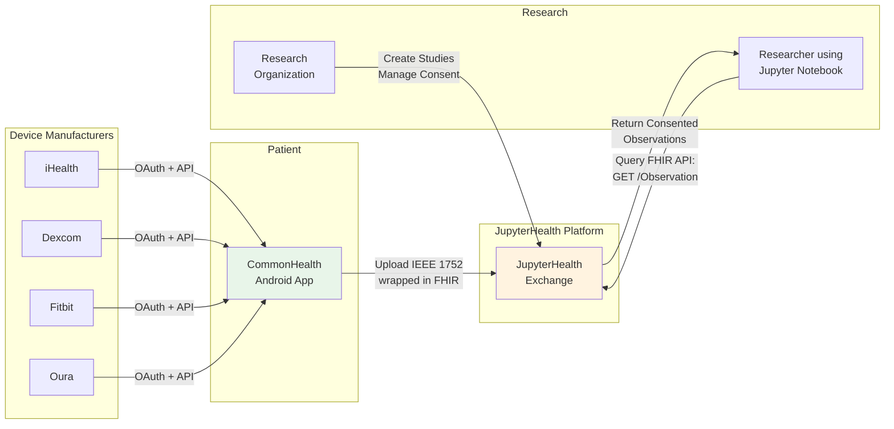
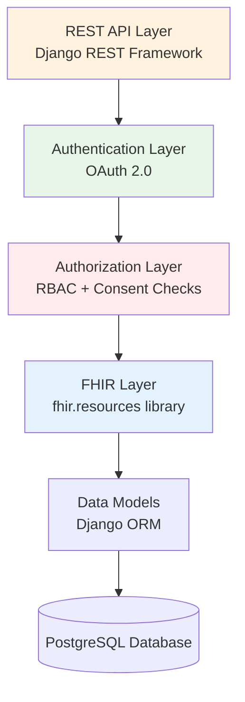
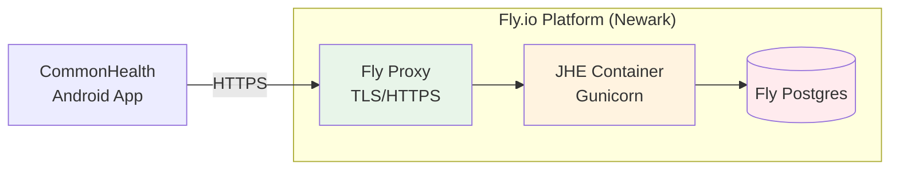

# JupyterHealth System Architecture

JupyterHealth is a modular ecosystem of interconnected components that enable patients to collect, control, and share their health data with researchers or clinicians. This document explains the architecture of each component and how they work together to support patient-centered health data exchange.

## System Overview

The JupyterHealth ecosystem enables patients to share health data from personal medical devices with research studies through consent-based access control.

### High-Level Data Flow



**Key Points**:

- **Device Manufacturers**: Patients' health devices sync data to manufacturer cloud APIs (glucose meters, CGMs, fitness trackers, smart rings)
- **CommonHealth App**: Retrieves data from manufacturers, transforms to IEEE 1752 standard, wraps in FHIR, uploads to JHE
- **JupyterHealth Exchange**: Manages patient consent, stores observations, provides research and clinical access via FHIR APIs
- **Research Organizations**: Create studies, enroll patients, manage consent
- **Researchers**: Query JHE FHIR API from Jupyter notebooks to analyze consented data

## Component Architecture

### 1. CommonHealth Android App

**Purpose**: Patient-facing mobile application for collecting health data from personal medical devices and uploading to JupyterHealth Exchange

**Role in System**:

CommonHealth serves as a data collection and consent management client for patients:

1. **Device Integration**: Connects to personal health devices and manufacturer APIs (glucose meters, continuous glucose monitors, fitness trackers, smart rings) as well as FHIR based APIs for clinical and insurance data
1. **Data Standardization**: Normalizes device data to Open mHealth (IEEE 1752) format
1. **FHIR Compatibility**: Packages standardized data as FHIR Observations for upload to JHE
1. **Consent Management**: Patient interface for enrolling in studies and managing data sharing consent
1. **Secure Communication**: Encrypted uploads to JHE via REST API

**Data Flow Example**:

```
Device Data → OMH Format → FHIR Observation → JupyterHealth Exchange
```

*Note: CommonHealth is developed by The Commons Project Foundation. For technical integration details, contact The Commons Project.*

### 2. JupyterHealth Exchange (Backend API)

**Technology**: Django, Django REST Framework, PostgreSQL

**Purpose**: Central data exchange hub managing patient data, consent, and research access

**Key Responsibilities**:

- Patient and practitioner management and authentication (OAuth 2.0)
- Organization and study management
- Consent management (granular, per-study, per-data-type)
- FHIR API for data upload and retrieval
- Role-based access control (Viewer, Member, Manager)
- Authorization enforcement (consent checks)

**Architecture Layers**:



**Core Models**:

- `JHEUser`: Base user model (extends Django AbstractUser)
- `Patient`: Patient profile with FHIR Patient resource
- `Practitioner`: Researcher/clinician profile
- `Organization`: Research organizations with hierarchical structure
- `Study`: Clinical studies within organizations
- `Observation`: FHIR Observation resources (health data)
- `StudyPatient`: Many-to-many relationship (patients enrolled in studies)
- `StudyPatientScopeConsent`: Granular consent per patient, study, and data type
- `PractitionerOrganization`: Many-to-many with role (viewer/member/manager)

**Key Features**:

- FHIR compliance for Observation and Patient resources
- Multi-tenant organization structure
- Consent-as-authorization (no consent = no access)
- Study-level data scoping
- RESTful API with Django REST Framework

**API Endpoints**:

**Admin API:**

- `users` - Practitioner management
- `organizations` - Organization management
- `patients` - Patient management
- `studies` - Study management
- `observations` - Observation management
- `data_sources` - Data Source management

**FHIR API:**

- `base` - batch upload
- `Observation` - Observation search and create
- `Patient` - Patient search and create

### 3. Jupyter-SMART-on-FHIR Extension

**Technology**: Python, Jupyter, OAuth 2.0

**Purpose**: Enable researchers to authenticate with JHE from Jupyter notebooks

**Key Responsibilities**:

- OAuth 2.0 client configuration for SMART on FHIR
- Token acquisition and refresh
- Jupyter server integration
- Provide authenticated FHIR client for notebooks

**Workflow**:

:::\{div}
:class: dark:hidden

```{mermaid}
%%{init: {'theme':'default'}}%%
sequenceDiagram
    participant R as Researcher
    participant J as Jupyter Notebook
    participant JHE as JupyterHealth Exchange
    participant OAuth as OAuth Provider

    R->>J: Start SMART on FHIR auth
    J->>OAuth: Redirect to authorization endpoint
    OAuth->>R: Login prompt
    R->>OAuth: Authenticate
    OAuth->>J: Authorization code
    J->>OAuth: Exchange code for token
    OAuth->>J: Access token
    J->>JHE: FHIR API request with token
    JHE->>J: Return consented data
```

:::

:::\{div}
:class: hidden dark:block

```{mermaid}
%%{init: {'theme':'dark'}}%%
sequenceDiagram
    participant R as Researcher
    participant J as Jupyter Notebook
    participant JHE as JupyterHealth Exchange
    participant OAuth as OAuth Provider

    R->>J: Start SMART on FHIR auth
    J->>OAuth: Redirect to authorization endpoint
    OAuth->>R: Login prompt
    R->>OAuth: Authenticate
    OAuth->>J: Authorization code
    J->>OAuth: Exchange code for token
    OAuth->>J: Access token
    J->>JHE: FHIR API request with token
    JHE->>J: Return consented data
```

:::

**Configuration**:

- Set client ID and secret in `jupyter_server_config.py`
- Configure FHIR scopes (patient/*.read, observation/*.read)
- Set authorization and token endpoints

**Use Cases**:

- Data analysis on consented research data
- Machine learning model training
- Statistical analysis of study cohorts

## Deployment Architecture

### Local Development Deployment

For local development and testing, JupyterHealth Exchange can be run using Django's built-in development server:

**Setup Steps**:

1. Set up Python environment (Python >= 3.10)
1. Install dependencies: `pipenv sync` (or `pip install -r requirements.txt`)
1. Create PostgreSQL database
1. Copy `dot_env_example.txt` to `.env` and update database credentials
1. Load environment: `pipenv shell`
1. Run migrations: `python manage.py migrate`
1. Seed database: `python manage.py seed`
1. Start server: `python manage.py runserver`
1. Access at http://localhost:8000 with credentials `mary@example.com` / `Jhe1234!`

**Note**: The Django development server should only be used for local development, not production deployments.

### Production Deployment (Fly.io)

The current JupyterHealth Exchange production deployment runs on Fly.io:



**Infrastructure Details**:

| Component       | Technology       | Configuration                                        |
| --------------- | ---------------- | ---------------------------------------------------- |
| **Platform**    | Fly.io           | Primary region: Newark (ewr)                         |
| **Application** | Docker container | Gunicorn with 2 workers, WhiteNoise for static files |
| **Compute**     | Fly.io VM        | 1GB RAM, 1 shared vCPU                               |
| **Database**    | Fly Postgres     | Managed PostgreSQL with automated backups            |
| **HTTPS**       | Fly Proxy        | Automatic TLS certificates, forced HTTPS             |
| **Scaling**     | Auto-scaling     | Min 1 machine, auto-stop/start on traffic            |
| **Deployment**  | GitHub Actions   | Automated deploy on push to main branch              |

**Deployment Workflow**:

1. Code pushed to GitHub main branch
1. GitHub Actions workflow triggered
1. `.env` file created from GitHub repository secrets
1. Docker image built with embedded `.env` file
1. Image deployed to Fly.io
1. Database migrations run automatically (`python manage.py migrate`)
1. New container started with zero downtime

**Environment Configuration**:

- All secrets stored in GitHub repository secrets (not Fly secrets)
- `.env` file generated at build time and included in Docker image
- Environment variables loaded via python-dotenv at runtime
- Includes: database credentials, OAuth keys, PKCE values, site configuration

**Alternative Deployment Options**:

For self-hosted or enterprise deployments, JHE can be deployed to:

- **AWS/Azure/GCP**: Using container services (ECS, AKS, Cloud Run)
- **Kubernetes**: Containerized deployment with Helm charts
- **Traditional VPS**: NGINX reverse proxy + gunicorn (see README)
- **On-premises**: Docker Compose for development/testing

The Dockerfile and gunicorn configuration support any container runtime or cloud platform.

## Component Dependencies

### Technology Stack Summary

| Component                  | Language | Framework   | Database         | Key Libraries       |
| -------------------------- | -------- | ----------- | ---------------- | ------------------- |
| CommonHealth (PHR-Android) | Kotlin   | Android SDK | Room + SQLCipher | HAPI FHIR, AppAuth  |
| JupyterHealth Exchange     | Python   | Django 5.2  | PostgreSQL       | fhir.resources, DRF |
| Jupyter Extension          | Python   | Jupyter     | N/A              | requests-oauthlib   |

### External Dependencies

**FHIR Libraries**:

- **Python**: `fhir.resources` - FHIR R4/R5 models and validation
- **Kotlin**: HAPI FHIR - Java FHIR implementation for Android (supports DSTU2, R4, R5)

**OAuth/Authentication**:

- Django OAuth Toolkit (JHE server-side)
- AppAuth (Android OAuth 2.0/OIDC client)

**Database**:

- PostgreSQL 14+ (JHE)
- Room with SQLCipher encryption (CommonHealth Android app)

**Standards Compliance**:

- FHIR R4/R5 (HL7)
- SMART on FHIR
- SMART Health Cards
- SMART Health Links
- OAuth 2.0 / OpenID Connect

## Interoperability Standards

### FHIR (Fast Healthcare Interoperability Resources)

JupyterHealth uses FHIR as the primary data exchange format:

**FHIR Version**:

- **FHIR**: JupyterHealth Exchange uses FHIR exclusively

**FHIR Resources Implemented in JHE**:

- `Patient`: Patient demographics, identifiers, contact information
- `Observation`: Health measurements and device data (primary data resource)

JHE focuses specifically on device-generated observations rather than comprehensive EHR data.

## Learn More

- [Exchange Overview](exchange-overview.md) - JupyterHealth Exchange details
- [FHIR Interoperability](fhir-interoperability.md) - FHIR implementation details
- [Data Flow](data-flow.md) - Detailed data flow documentation
- [Security Overview](security-overview.md) - Security architecture and compliance
- [Role-Based Access and Governance](rbac-governance.md) - Access control details
