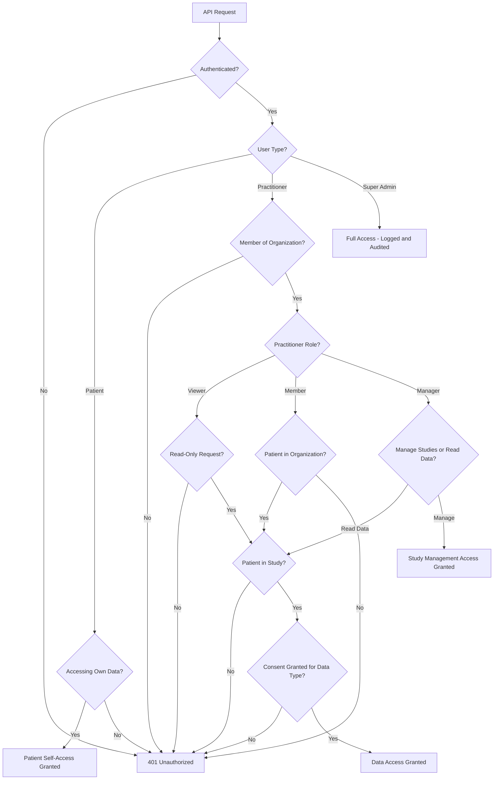

# Role-Based Access Control and Governance

JupyterHealth Exchange (JHE) implements a comprehensive role-based access control (RBAC) system to manage user permissions across organizations, studies, and patient data. This document explains the user types, role hierarchy, permissions, and governance model.

## User Types

JHE has three distinct user types with different authorization models:

### 1. Patient

**Authorization Model**: Self-access with full control over own data

**Capabilities**:
- View own patient record and consent status
- Modify own consent decisions per study and data type
- Upload health data to JHE (via CommonHealth app)
- Cannot access other patients' data under any circumstances

**No Role Assignment**: Patients do not have roles. They always have complete access to their own records and consent management without requiring organization membership or role assignments.

**Organization Membership**: Patients can be members of multiple organizations via `PatientOrganization` relationships. This membership determines which organizations' studies they can see and consent to, but does not grant them access to organizational management functions.

### 2. Practitioner

**Authorization Model**: Organization-scoped access with hierarchical roles

**Organization Membership**: Practitioners must be members of an organization via `PractitionerOrganization` relationships. Each membership includes a role assignment (Viewer, Member, or Manager).

**Multi-Organization Support**: A practitioner can be a member of multiple organizations with different roles in each. For example:
- Manager role in "University Hospital Research Dept"
- Viewer role in "Clinical Trials Consortium"

**Access Scope**: Practitioners can only access data within their organization(s) and only for patients who have consented to share data with studies in those organizations.

### 3. Super Admin

**Authorization Model**: System-wide access for administration

**Capabilities**:
- System administration and maintenance
- Can bypass normal authorization checks (all access is logged and audited)
- Used only for troubleshooting, infrastructure maintenance, and emergency scenarios

**Security Considerations**:
- Super admin access should be tightly controlled and limited to technical staff
- All super admin actions are logged with timestamps and user identification
- Access should be periodically reviewed and audited
- Consider implementing multi-factor authentication (MFA) requirements for super admin accounts

## Practitioner Role Hierarchy

Practitioners are assigned one of three hierarchical roles within each organization they belong to. Roles follow an inheritance model where higher roles include all permissions of lower roles.

**Inheritance Principle**:
- **Manager** has all Member permissions + additional management capabilities
- **Member** has all Viewer permissions + patient/consent management capabilities
- **Viewer** has read-only access to consented data

### Role Descriptions

#### Viewer (Read-Only Access)

**Intended For**: Data analysts, research staff, auditors who need to review study data without making changes

**Permissions**:
- ✅ View patient data within consented studies
- ✅ View study definitions and enrollment lists
- ✅ View consent status for patients in studies
- ❌ Cannot create or modify patients
- ❌ Cannot manage consent on behalf of patients
- ❌ Cannot create studies or manage practitioners

**API Access**: Read-only endpoints for FHIR resources, study lists, and patient enrollment

**Use Cases**:
- Data scientist analyzing aggregated study results
- Quality assurance reviewer verifying data collection
- External auditor reviewing research compliance

#### Member (Patient and Consent Management)

**Intended For**: Research coordinators, clinical staff who directly interact with study participants

**Permissions**:
- ✅ All Viewer permissions (read access to data)
- ✅ Create and update patient records
- ✅ Enroll patients into studies
- ✅ Manage consent on behalf of patients (with proper authorization)
- ✅ Update patient demographics and contact information
- ❌ Cannot create studies
- ❌ Cannot manage practitioner roles

**API Access**: Full CRUD (Create, Read, Update, Delete) on patient and consent resources within their organization's studies

**Use Cases**:
- Research coordinator enrolling participants and collecting consent
- Clinical staff updating patient information after study visits
- Study nurse managing participant enrollment status

**Important Note on Consent Management**: While Members can technically modify consent on behalf of patients, this should only be done with proper documented authorization (e.g., signed consent forms). Organizations should implement policies requiring audit trails for practitioner-initiated consent changes.

#### Manager (Full Administrative Control)

**Intended For**: Principal investigators, organization administrators, research directors

**Permissions**:
- ✅ All Member permissions (patient and consent management)
- ✅ Create, update, and archive studies
- ✅ Add and remove practitioners from the organization
- ✅ Assign roles to practitioners (Viewer, Member, Manager)
- ✅ Manage organization settings and configuration
- ✅ View organization-wide audit logs

**API Access**: Full administrative access to all organization resources, studies, practitioners, and patients

**Use Cases**:
- Principal investigator creating new studies and managing research team
- Research director assigning roles to staff based on responsibilities
- Organization administrator configuring settings and reviewing audit logs

**Governance Responsibilities**: Managers are responsible for ensuring proper role assignments, reviewing access periodically, and maintaining separation of duties where appropriate.

## Role-Permission Matrix

| Permission | Viewer | Member | Manager |
|------------|--------|--------|---------|
| **Data Access** |
| View consented patient data | ✅ | ✅ | ✅ |
| View study definitions | ✅ | ✅ | ✅ |
| View consent status | ✅ | ✅ | ✅ |
| **Patient Management** |
| Create patient records | ❌ | ✅ | ✅ |
| Update patient information | ❌ | ✅ | ✅ |
| Enroll patients in studies | ❌ | ✅ | ✅ |
| Remove patients from studies | ❌ | ✅ | ✅ |
| **Consent Management** |
| Manage consent on behalf of patients | ❌ | ✅ | ✅ |
| View consent history | ✅ | ✅ | ✅ |
| **Study Management** |
| Create studies | ❌ | ❌ | ✅ |
| Update study settings | ❌ | ❌ | ✅ |
| Archive/close studies | ❌ | ❌ | ✅ |
| **Organization Management** |
| Add practitioners to organization | ❌ | ❌ | ✅ |
| Remove practitioners | ❌ | ❌ | ✅ |
| Assign practitioner roles | ❌ | ❌ | ✅ |
| View organization audit logs | ❌ | ❌ | ✅ |

## Authorization Enforcement Flow

The following flowchart shows how JHE evaluates authorization for API requests. Access is granted only after passing through all applicable checks.

### Access Control Layers

Every API request passes through multiple layers of authorization checks:

1. **Authentication**: Valid OAuth 2.0 token required. Unauthenticated requests are rejected immediately.

2. **User Type Identification**: Token identifies user as Patient, Practitioner, or Super Admin. Different authorization logic applies to each type.

3. **Organization Membership** (for Practitioners):
   - Patients: Must be enrolled in organization via `PatientOrganization`
   - Practitioners: Must be member via `PractitionerOrganization` with assigned role

4. **Study Enrollment Check**: Patient must be enrolled in the specific study being queried. Practitioners cannot access data for patients not enrolled in their studies.

5. **Consent Verification**: Patient must have granted consent to share the specific data type with the study. This is the final and most critical check.

6. **Role Permission Check** (for Practitioners):
   - **Viewer**: Only read operations allowed (GET requests)
   - **Member**: Can perform patient/consent management operations (POST, PUT, DELETE on patient/consent resources)
   - **Manager**: Can perform study and organization management operations

### Example Authorization Scenarios

**Scenario 1: Viewer Attempts to Enroll a Patient**

When a viewer tries to enroll a patient into a study, the system rejects the request with a forbidden error. The viewer's token is valid and they're authenticated, but the role permission check at the final authorization layer prevents the action because viewers can only perform read operations, not patient enrollment.

---

**Scenario 2: Member Accesses Consented Data**

When a member queries observations for a patient in a specific study, the request passes through all authorization layers: the token is validated, the user is identified as a practitioner, membership in the organization owning the study is verified, the patient's enrollment in the study is confirmed, consent to share the requested data type is validated, and finally the member role's read permission is checked. All checks pass, and observations matching the patient's consent are returned.

---

**Scenario 3: Patient Accesses Own Data**

When a patient accesses their own patient record, authorization is straightforward. The system validates the token, identifies the user as a patient, confirms they're accessing their own record (not another patient's), and grants access immediately. No consent check is needed because patients always have full access to their own data.

---

**Scenario 4: Manager Creates a Study**

When a manager creates a new study, the authorization flow validates the token, identifies the user as a practitioner, confirms organization membership, and verifies the manager role. All checks pass, and the study is created within the manager's organization.

## Governance Best Practices

### Role Assignment Guidelines

**Principle of Least Privilege**: Assign the minimum role necessary for each practitioner's job function.

**Recommended Role Assignments**:
- **Viewer**: Default role for new staff, data analysts, external auditors
- **Member**: Research coordinators, clinical staff with patient-facing responsibilities
- **Manager**: Principal investigators, research directors (limit to 2-3 per organization)

**Avoid Over-Privileging**:
- Do not assign Manager role to staff who only need data access
- Do not assign Member role to staff who only need to view results
- Regularly review role assignments and demote when responsibilities change

### Separation of Duties

For organizations handling sensitive research, consider implementing separation of duties:

**Example Separation**:
- **Data Collection Team** (Members): Enroll patients, manage consent
- **Analysis Team** (Viewers): Access data for analysis, cannot modify enrollment
- **Administrative Team** (Managers): Create studies, assign roles, review audit logs

This separation prevents a single person from having complete control over data collection, analysis, and reporting.

### Audit and Review Procedures

**Quarterly Access Review**:
1. Export list of all practitioners and their roles
2. Verify each role assignment is still appropriate
3. Remove practitioners who have left the organization
4. Demote practitioners whose responsibilities have changed

**Consent Audit**:
- Review practitioner-initiated consent changes monthly
- Verify consent changes have proper documentation (signed forms)
- Investigate any unusual patterns (bulk consent changes, off-hours activity)

**Study Lifecycle Review**:
- Identify completed studies that should be archived
- Remove practitioner access to archived studies
- Implement data retention policies (manual deletion currently required)

### Multi-Organization Practitioners

Some practitioners may need access to multiple organizations (e.g., collaborative research networks). Best practices:

**Role Consistency**: Consider assigning the same role across organizations for simplicity, unless there's a specific reason for different access levels.

**Access Scope Documentation**: Maintain documentation of which practitioners have multi-organization access and why.

**Periodic Review**: Multi-organization access should be reviewed more frequently (e.g., quarterly instead of annually).

## Learn More

- [Security Overview](security-overview.md) - HIPAA/GDPR compliance and encryption
- [Consent Management](consent-management.md) - How consent interacts with RBAC
- [Data Flow](data-flow.md) - Authorization checks in the data pipeline
