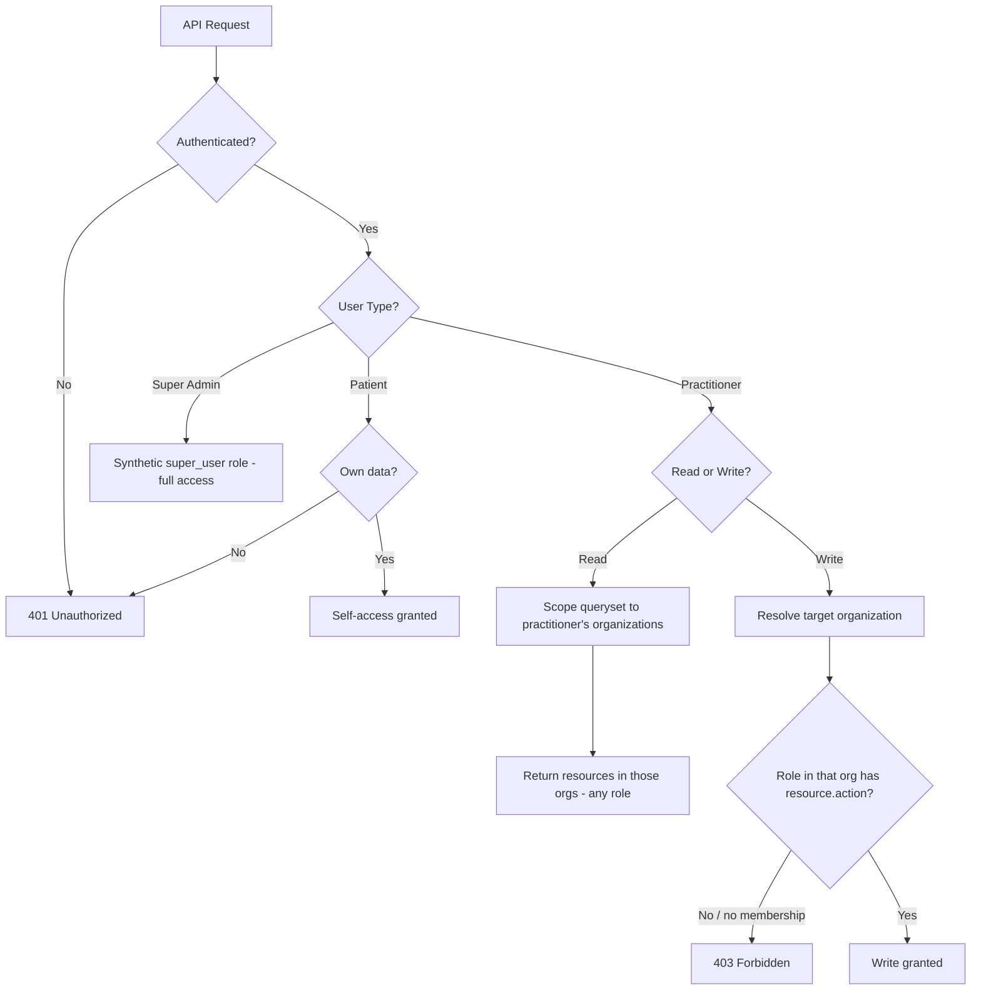

# Role-Based Access Control

JHE uses a simple role-based access control (RBAC) system to
manage who can read and write organizations, studies, patients, and health data. This
document explains the user types, the practitioner role hierarchy, how permissions are
resolved per-organization, and how patient consent fits in.

The implementation lives in [`core/permissions.py`](https://github.com/jupyterhealth/jupyterhealth-exchange/blob/main/core/permissions.py)
(the `IfUserCan` permission factory and the `ROLE_PERMISSIONS` table) and in the
per-resource queryset scoping in each viewset under
[`core/views/`](https://github.com/jupyterhealth/jupyterhealth-exchange/tree/main/core/views).

## Two independent dimensions: read scope vs. write permission

The single most important thing to understand is that JHE controls **reads** and **writes**
by two different mechanisms:

- **Read access is scoped by *organization membership*, not by role.** Every list/detail
  endpoint filters its queryset to the resources that belong to an organization the
  practitioner is a member of. A `viewer` and a `manager` in the same organization see
  **exactly the same data** — the role makes no difference to what can be read.

- **Write access is gated by *role*.** Creating, updating, or deleting a resource runs
  through the `IfUserCan` permission, which looks up the practitioner's role *in the
  organization that owns the target resource* and checks it against `ROLE_PERMISSIONS`.

So "Viewer" does not mean "can read less" — it means "can read the same, but cannot
write." Keep this distinction in mind throughout.

```{important}
**Role does not narrow reads.** If you need a practitioner to *not see* certain patients
or studies, that is controlled by which organizations they belong to, not by giving them a
lower role. Lowering the role only removes their ability to make changes.
```

## User Types

JHE has three distinct user types with different authorization models. The user type is
stored on `JheUser.user_type` (`patient` / `practitioner`), with Super Admin being the
Django `is_superuser` flag.

### 1. Patient

**Authorization model**: API-only access with full control over their own data.

```{important}
**No Console access.** Patients do NOT have access to the JupyterHealth Exchange Console.
The Console is for Practitioners and Admins only. Patients interact with JHE through:
- a **JHE Client** (e.g. the CommonHealth mobile app),
- an **authorized Patient-Access Client** (email one-time-code login), or
- **direct API / FHIR calls**.
```

**Capabilities** (via API or mobile app):

- View their own patient record, study enrollments, and consent status
  (`GET /api/v1/patients/me`, `GET /api/v1/patients/{id}/consents`).
- Set and revoke their own consent decisions, per study and per data type.
- Upload health data for scopes they have consented to (via the FHIR API).
- Cannot access any other patient's data under any circumstances.

**No role assignment.** Patients do not have roles. They always have complete access to
their own records and consent management without requiring a role.

**Organization membership.** Patients can belong to multiple organizations via
`PatientOrganization` rows. This determines which organizations' studies they can see and
consent to, but does not grant Console access or any management capability.

### 2. Practitioner

**Authorization model**: organization-scoped access with a per-organization role.

**Organization membership.** A practitioner must be a member of an organization via a
`PractitionerOrganization` row. **Each membership carries its own role** (Viewer, Member,
or Manager).

**Multi-organization, per-organization roles.** A practitioner can belong to several
organizations and hold a *different role in each*. For example:

- **Manager** in "Cosmic Cardio Lab",
- **Member** in "Neptunian Pulse Lab",
- **Viewer** in "Lifespan Lab".

Their abilities are evaluated separately for each organization: they can manage studies in
the first two but only read in the third.

**Access scope.** A practitioner can read data for every patient who shares one of their
organizations, and can write to the extent their role in the owning organization allows.

### 3. Super Admin

**Authorization model**: system-wide access (`JheUser.is_superuser`).

A superuser is treated as having the synthetic `super_user` role for every organization, so
all `IfUserCan` checks pass. In addition, several resources are **superuser-only**:

- **Practitioner accounts** — create/update/delete practitioners
  ([`PractitionerViewSet`](https://github.com/jupyterhealth/jupyterhealth-exchange/blob/main/core/views/practitioner.py), `IsSuperUser`).
- **Patient OAuth clients** — the patient data-provider clients managed at `/api/v1/clients`
  (`client.manage`, held only by `super_user`).
- **Data sources / devices** — `/api/v1/data_sources` (`data_source.manage`, `super_user` only).
- **System settings** — `/api/v1/jhe_settings`
  ([`JheSettingViewSet`](https://github.com/jupyterhealth/jupyterhealth-exchange/blob/main/core/views/jhe_setting.py), `IsSuperUser`).
- **Top-level organizations** — creating an organization with no parent (see
  [Organization hierarchy](#organization-hierarchy-and-authority) below).

**Security considerations.** Super admin access should be tightly controlled and limited to
technical staff, periodically reviewed, and ideally protected with MFA.

## Practitioner Role Hierarchy

Each `PractitionerOrganization` row assigns one of three roles
([`core/models/practitioner.py`](https://github.com/jupyterhealth/jupyterhealth-exchange/blob/main/core/models/practitioner.py)).
Roles are cumulative — a higher role has every permission of the lower one plus more.

**Inheritance:**

- **Manager** = Member + manage the organization's practitioners.
- **Member** = Viewer + manage the organization's patients and studies.
- **Viewer** = read-only (no write permissions at all).

### Viewer (read-only)

**Intended for**: data analysts, research staff, and auditors who review data without
changing it.

- ✅ Read every study, patient, and observation in their organizations (same read scope as
  any other role).
- ❌ Cannot create or modify patients, studies, consents, or practitioner memberships.

`ROLE_PERMISSIONS["viewer"]` is an **empty list** — a viewer holds no write permission, so
every create/update/delete is rejected, while reads (which are not permission-gated) still
succeed.

### Member (patient & study management)

**Intended for**: research coordinators and clinical staff who run studies and enroll
participants.

- ✅ All Viewer reads.
- ✅ Create, update, and delete **patients** in their organization
  (`patient.manage_for_organization`).
- ✅ Create, update, and delete **studies** in their organization, and manage a study's
  patients, scope requests, clients, and data sources (`study.manage_for_organization`).
- ✅ Set/revoke consent on behalf of a patient in their organization's studies (with proper
  documented authorization — see the consent note below).
- ❌ Cannot add/remove practitioners or change practitioner roles.

### Manager (organization administration)

**Intended for**: principal investigators and organization administrators.

- ✅ All Member capabilities.
- ✅ Add and remove practitioners in the organization, and assign their roles
  (`organization.manage_for_practitioners` — the `POST`/`DELETE` `user` and `remove_user`
  actions on the organization).
- ✅ Update and delete the organization entity itself, and create **sub-organizations**
  under it.

A manager's authority is **per-organization**: it applies only to the organization (and its
direct children) where they hold the manager role.

## Role–Permission Matrix

These are the actual permission strings in
[`ROLE_PERMISSIONS`](https://github.com/jupyterhealth/jupyterhealth-exchange/blob/main/core/permissions.py).
Each is checked by `IfUserCan("<resource>.<action>")` against the practitioner's role in the
**organization that owns the target resource**.

| Permission (`resource.action`)          | Viewer | Member | Manager | Super Admin |
| --------------------------------------- | :----: | :----: | :-----: | :---------: |
| *(read any resource in your orgs)*      |   ✅   |   ✅   |   ✅    |     ✅      |
| `patient.manage_for_organization`       |   ❌   |   ✅   |   ✅    |     ✅      |
| `study.manage_for_organization`         |   ❌   |   ✅   |   ✅    |     ✅      |
| `organization.manage_for_practitioners` |   ❌   |   ❌   |   ✅    |     ✅      |
| `organization.create_top_level`         |   ❌   |   ❌   |   ❌    |     ✅      |
| `client.manage`                         |   ❌   |   ❌   |   ❌    |     ✅      |
| `data_source.manage`                    |   ❌   |   ❌   |   ❌    |     ✅      |

Notes:

- The first row is not a `ROLE_PERMISSIONS` entry — it is a reminder that **reads are gated
  by organization membership, not role**, so every role reads the same set.
- `patient.manage_for_organization` covers patient create/update/delete **and**
  practitioner-initiated consent changes.
- `study.manage_for_organization` covers study create/update/delete and the study's
  sub-resources (patients, scope requests, clients, data sources).
- `client.manage` and `data_source.manage` are held only by `super_user`, so the patient
  OAuth clients and data sources are effectively superuser-only.

## How authorization is enforced

### `IfUserCan` — per-organization role resolution

Write endpoints declare a permission like
`IfUserCan("study.manage_for_organization")`. On each request it:

1. Confirms the request is **authenticated** (else `401`).
1. If the user is a **superuser** and the resource is one of
   `client / data_source / organization / practitioner / patient / study`, grants the
   synthetic `super_user` role (full pass).
1. Otherwise **resolves which organization the action targets** (see below) and looks up the
   practitioner's `PractitionerOrganization.role` for that exact organization.
1. Checks `permission in ROLE_PERMISSIONS[role]`. No matching role link, or a role without
   the permission, → `403`.

The targeting organization is derived differently per resource and action:

| Resource & action                         | Organization the role is checked against                           |
| ----------------------------------------- | ------------------------------------------------------------------ |
| Create **patient**                        | `organization_id` in the request body                              |
| Create **study**                          | `organization` in the request body                                 |
| Create **organization** (sub-org)         | `part_of` (the **parent** organization) in the request body        |
| Update/delete **patient**                 | `organization_id` query parameter                                  |
| Update/delete **study**                   | the study's own `organization`                                     |
| Add/remove practitioner on an org         | **that organization itself** (`user` / `remove_user` actions)      |
| Update/delete the **organization** entity | the **parent** organization (or the org itself if it is top-level) |

### Read scoping (queryset filtering)

Reads do not use `IfUserCan`. Instead each viewset's `get_queryset()` (and, for the FHIR
API, each model's `fhir_search`) restricts results to the caller's organizations:

- **Patients**: every patient who shares an organization with the practitioner
  (`Patient.for_practitioner_organization_study`). Study enrollment is *not* required.
- **Studies**: studies under an organization the practitioner belongs to
  (`Study.for_practitioner_organization`).
- **Observations**: observations of patients who share one of the practitioner's
  organizations (`Observation.for_practitioner_organization_study_patient`).
- **Patient self-reads**: a patient sees only their own record, enrollments, and
  observations.

A practitioner of *any* role gets this full read scope; the role only governs writes.

## Organization hierarchy and authority

Organizations form a tree via `Organization.part_of`. Authority flows with the tree:

- **Top-level organizations** (no `part_of`) can be created **only by a superuser**. The
  organization create view rejects a top-level create from a non-superuser outright, and
  `organization.create_top_level` is a `super_user`-only permission.
- **Sub-organizations** can be created by a **manager of the parent** organization (the
  `IfUserCan` check resolves the role against `part_of`). The practitioner who creates a
  sub-organization is automatically made its **manager**.
- **Updating or deleting** an organization checks the manager role against its **parent**
  (or against itself if it is top-level).
- **Adding/removing practitioners** in an organization checks the manager role against
  **that organization itself**, not its parent.

## Patient consent and what it gates

Consent is recorded per study and per data-type scope in `StudyPatientScopeConsent`
(`consented = true/false`), against the scopes a study requests in `StudyScopeRequest`.
Consent governs:

- **What a patient may upload.** On Observation create, the data's code must be one of the
  patient's actively consented scopes, or the upload is rejected
  (`Observation._omh_payload` → `consolidated_consented_scopes`).
- **What the consent screens show.** The `consents` endpoint reports each study's pending
  and granted scopes for the patient.
- **Study-scoped FHIR Observation reads.** When an Observation search is narrowed by
  `study_id`, results are limited to codes the study requested (and patients enrolled in it).

```{important}
**Consent is *not* a per-read gate on practitioner access.** A practitioner who shares an
organization with a patient can read that patient's stored observations regardless of the
patient's per-study consent flags. Consent constrains what data *exists* (patients only
upload consented scopes) and how study-scoped queries filter, but the practitioner read
boundary is **organization membership**. If consent-gated practitioner reads are required,
that is not the behavior today.
```

Who may change a consent (the `POST`/`PATCH`/`DELETE` consents endpoint):

- the **patient** themselves; or
- a **practitioner** who is a **member or manager** of the organization owning the study
  (a viewer cannot); or
- a **superuser**.

## Practitioner self-service API clients

A practitioner can mint their own machine-to-machine OAuth credentials (an API key) without
admin involvement, via `PractitionerClient`
([`core/views/practitioner_client.py`](https://github.com/jupyterhealth/jupyterhealth-exchange/blob/main/core/views/practitioner_client.py)).

- The endpoint (`/api/v1/practitioner_clients`) requires the caller to be a **practitioner**
  (`IsPractitioner`); patients get `403`, anonymous gets `401`.
- The queryset is scoped to the caller's **own** clients, so one practitioner can never
  read or delete another's (others' rows simply `404`).
- The created OAuth application uses the **client-credentials** grant; the returned API key
  is `base64(client_id:client_secret)`.

See the dedicated write-up for full details (model, key format, lifecycle).

## Default organization assignment for new practitioners

This is an **optional System Admin feature**, off by default. When enabled, the moment a
practitioner `JheUser` is first created JHE auto-assigns organization memberships
and roles from the `auth.default_orgs` setting
([`core/models/jhe_user.py`](https://github.com/jupyterhealth/jupyterhealth-exchange/blob/main/core/models/jhe_user.py)).
The value is a `;`-separated list of `<org_id>:<role>` pairs, e.g. `20001:viewer;20002:manager`.
Each referenced organization must exist and each role must be valid, or creation fails with a
validation error. Leave the setting empty to assign memberships manually.

## Authorization Enforcement Flow



### Layers in order

1. **Authentication** — a valid OAuth 2.0 token is required; otherwise `401`.
1. **User-type branch** — Patient (self-scoped), Practitioner (org-scoped), or Super Admin
   (full).
1. **Read** — queryset is filtered to the practitioner's organizations; role is irrelevant.
1. **Write** — `IfUserCan` resolves the target organization, looks up the practitioner's
   role there, and checks `ROLE_PERMISSIONS`; mismatch → `403`.
1. **Consent** — applies to patient uploads and study-scoped Observation reads (not to the
   practitioner read boundary).

### Example scenarios

**Viewer attempts to enroll a patient** → `403`. The viewer is authenticated and can *read*
the study, but `study.manage_for_organization` is not in `ROLE_PERMISSIONS["viewer"]`.

**Member creates a study** → granted. `study.manage_for_organization` is in the member's
permissions for that organization.

**A practitioner who is a member of Neptunian Pulse Lab tries to edit a study in Lifespan
Lab (where they are a viewer)** → `403`. The role is resolved against Lifespan Lab (the
study's owner), where they lack the permission.

**Practitioner reads a patient's observations** → granted if they share any organization
with the patient, regardless of role or the patient's consent flags.

**Patient reads their own consents** → granted immediately; a patient reading another
patient's record → `403`.

**Manager adds a practitioner to their organization** → granted via
`organization.manage_for_practitioners`, checked against that organization.

## Governance Best Practices

### Principle of least privilege

Assign the lowest role that lets a practitioner do their job, **per organization**:

- **Viewer** — analysts, auditors, and anyone who only needs to read.
- **Member** — coordinators and clinical staff who manage patients, studies, and consent.
- **Manager** — PIs and org admins who also manage practitioners and sub-organizations
  (keep this small).

Remember that lowering a role removes *write* ability only; to restrict what a practitioner
can *see*, change their **organization memberships**.

### Separation of duties

For sensitive research, split responsibilities across roles and people, e.g. Members run
data collection and consent, Viewers analyze, and a small number of Managers administer the
organization and its practitioners.

### Audit and review

- Review each practitioner's organization memberships and roles periodically; remove people
  who have left and demote those whose responsibilities have changed.
- Treat **multi-organization** practitioners with extra scrutiny — they may hold different
  roles across orgs; review those more frequently.
- Review practitioner-initiated **consent changes** and require documented authorization
  (e.g. signed forms).
- Tightly control **superuser** accounts (they bypass role checks and exclusively manage
  practitioners, clients, data sources, settings, and top-level organizations).
