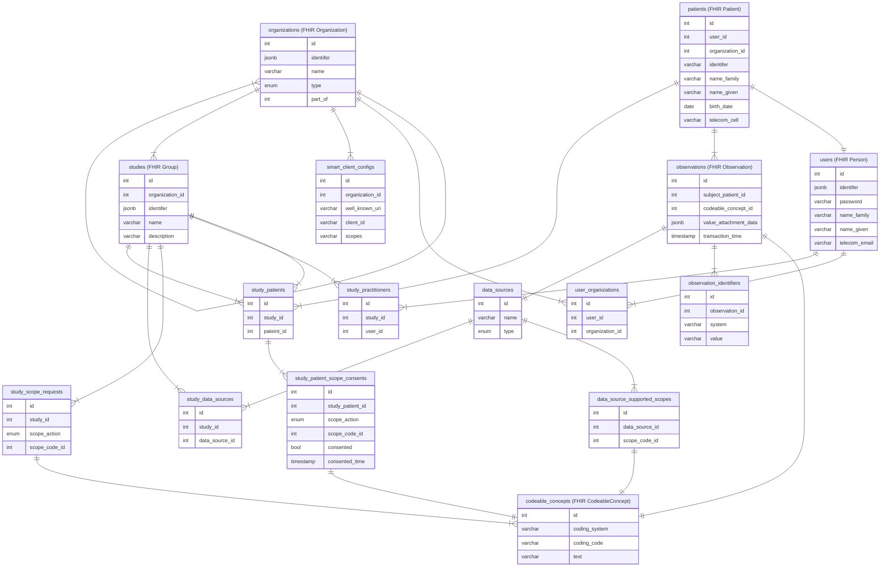

## Django

Django is a mature and well-supported web framework but was specifically chosen due to resourcing requirements. There are a few accommodations that had to be made for Django to support FHIR as described below.

### camelCase

- FHIR uses camelCase whereas Django uses snake_case.
- The [djangorestframework-camel-case](https://github.com/vbabiy/djangorestframework-camel-case) library is used to support camelCase but the conversion happens downstream whereas the schema validation happens upstream, so manually calling `humps` is also required in parts.

### DRF Serializers and Pydantic

- The Django Rest Framework uses the concept of Serializers to validate schemas, whereas the FHIR validator uses Pydantic.
- It is not reasonable to re-write the entire validation in the Serializer, so instead a combination of the two are used:
  - Top-level fields (most importantly the `id` of a record) are managed by the Serializer.
  - Nested fields (for example `code{}.coding[].system` above) are configured as a JSON field in the Serializer (so the top level field is this example is `code`) and then Pydantic is used to validate the whole schema including nested JSON.

- The [drf-pydantic](https://github.com/georgebv/drf-pydantic) library may allow Pydantic to be used as a Serializer, but this needs to be explored further.

### JSON Responses

- Postgres has rich JSON support allowing responses to be built directly from a raw Django SQL queries rather than using another layer of transforming logic.

## Single Page App (SPA) Web UI

A hard requirement was to avoid additional servers and frameworks (eg npm, react, etc) for the front end Web UI. Django supports traditional server-side templating but a modern Single Page App is better suited to this use case of interacting with the Admin REST API. For these reasons, a simple Vanilla JS SPA has been developed using [handlebars](https://github.com/handlebars-lang/handlebars.js) to render client side views from static HTML served using Django templates. The only other additional dependencies are [oidc-clinet-ts](https://github.com/authts/oidc-client-ts) for auth and [bootstrap](https://github.com/twbs/bootstrap) for styling.

## Data Model

```{caution} To be updated
```


