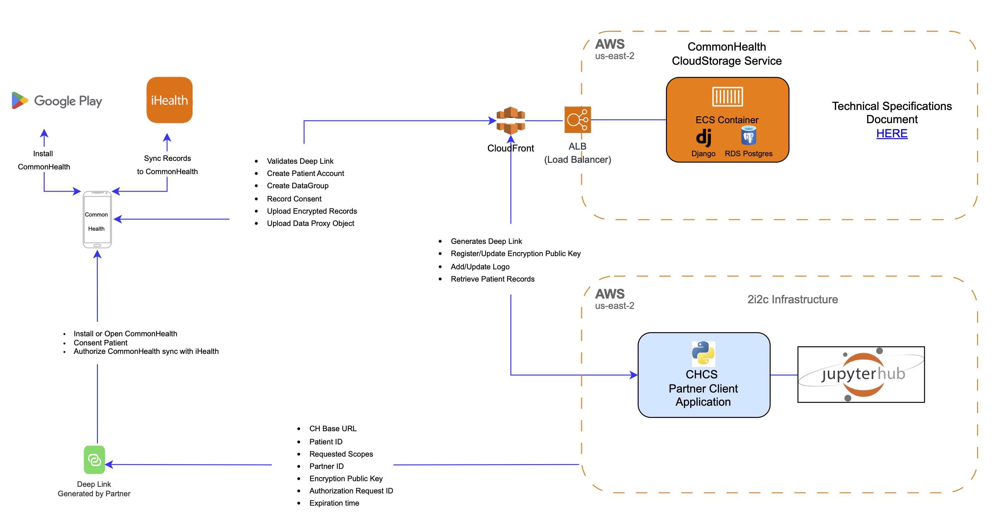

## Introduction

The JupyterHealth Pre-MVP security focuses on establishing a secure privacy-preserving transmission of patient data from:

## API Credentials

- CommonHealth Application will authenticate with the Medical Device API using:
  - Client ID
  - Client Secret
- Each Partner will authenticate with the CloudStorage Service using:
  - Partner ID
  - Client ID
  - Client Secret

### API credentials in JupyterHub

The JupyterHealth pre-MVP application is registered as a Partner application (two, actually - one 'prod' to represent the pre-MVP itself, and one 'testing' for testing configurations).

There are two partner applications registered:

- 'prod' represents the pre-MVP
- 'testing' for testing out functionality

These credentials are stored in AWS SecretManager:

- `ch-cloud-creds-{name}` contains the partner id, client id/secret, etc. required to access the CommonHealth Cloud API
- `ch-cloud-storage-{name}` contains the state of the CH Cloud "storage delegate".
  This is the local storage of:
  - decryption keys for patient data
  - patient id/uuid mapping

The JupyterHub user 'role' is granted read access to `ch-cloud-creds-{name}` and read/write access to `ch-cloud-storage-{name}`.

#### Pre-MVP considerations

In the pre-MVP, from the perspective of CommonHealth cloud and data access, all JupyterHub users are equivalent and indistinguishable and act collectively _as_ the pre-MVP.
That is, all JupyterHub users have:

- read access to the client id/secret to access the API in order to:
  - create new deep links to register users
  - fetch encrypted patient data
- read/write access to the decryption key for decrypting patient data
- read/write access to the patient id mapping to identify patients and store new patient id mappings

Following the pre-MVP, users will login to JupyterHub with SMART-on-FHIR as an OAuth provider,
and will authenticate directly _as themselves_ via scoped access tokens,
rather than always acting as the partner application.
This will allow per-user access control, registered and enforced by SMART-on-FHIR, outside JupyterHub.

## Encryption

- Each Partner will generate a set of Private/Public keys that will used for encryption and decryption of patient data.
- The Partner Public encryption key will be stored in the CloudStorage Service.
- The CommonHealth Application will use the Partner's Public Key to encrypt the patient data before storing it in the CloudStorage Service.
- The Partner's Private Key will be used to decrypt the patient data when retrieved from the CloudStorage Service.

## Cryptography

- Google Tink is utilized for client-side as well as server-side cryptography.

- The following primitives are required:

  - DataGroup encryption key pair: HybridEncryption using the following algorithms: ECIES_P256_HKDF_HMAC_SHA256_AES128_GCM

  - EncryptedRecord DEK: AEAD using the following algorithms: AES256_GCM

  - Signing key(s) for TrustedPartners: ECDSA_P256

## Data Flow Diagram

